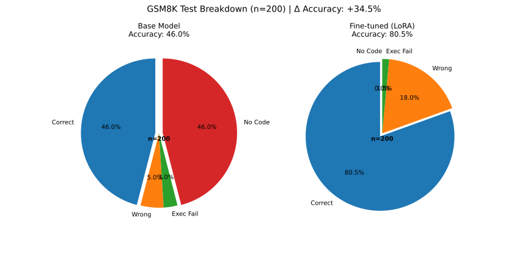
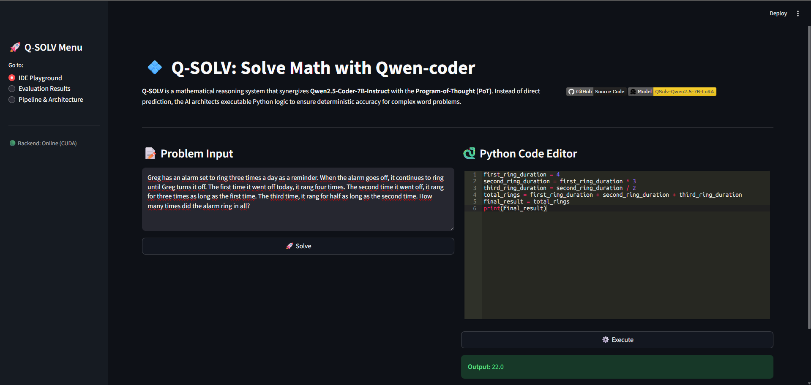

# ♾️ Q-SOLV: Stop Guessing, Start Executing.

**Q-SOLV** is a specialized Math-Coding IDE designed to reduce hallucination in mathematical reasoning. While standard LLMs often fail at multi-step arithmetic, Q-SOLV leverages a fine-tuned **Qwen2.5-Coder-7B** to transform natural language problems into precise, executable Python scripts.

> **The Core Idea:** If an AI can't do the math, it should write the code that can.

---

## 📺 Demo Video
*(Click the badge below to watch Q-SOLV in action)*

[](https://youtu.be/7_Wj5OSEBtc)

---

## 🛠️ Tech Stack & Core Technologies

### **Model & Training**
* **Base Model:** [Qwen2.5-Coder-7B-Instruct](https://huggingface.co/Qwen/Qwen2.5-Coder-7B-Instruct) - Optimized for high-reasoning code and math tasks.
* **Fine-tuning Framework:** [Unsloth](https://github.com/unslothai/unsloth) - Leveraged for memory-efficient QLoRA training on 1,738 GSM8K samples verified by execution-based checking.

### **Dual-Engine Inference**
* **GPU Engine (Logic):** [Unsloth Inference](https://github.com/unslothai/unsloth) - Fast, native 4-bit inference for CUDA-enabled environments.
* **CPU Engine (Logic_CPU):** [Llama.cpp](https://github.com/ggerganov/llama.cpp) - Optimized GGUF inference for cross-platform compatibility and resource-constrained devices.
* **Inference Orchestrator:** [FastAPI](https://fastapi.tiangolo.com/) - Managing high-performance requests between the IDE and the model engines.

### **Execution & UI**
* **Frontend IDE:** [Streamlit](https://streamlit.io/) - Featuring a custom dual-pane layout with [Streamlit-Ace](https://github.com/okld/streamlit-ace) integration.

---

## 🗺️ System Pipeline


---

## 📦 Model Weights

Q-SOLV supports both **GPU inference (Unsloth)** and **CPU inference (llama.cpp)**.  
You can choose the appropriate weights depending on your hardware.

- **LoRA Adapter (Hugging Face):**  
  [dainlieu/qsolv-qwen2.5-coder-7b-lora-gsm8k](https://huggingface.co/dainlieu/qsolv-qwen2.5-coder-7b-lora-gsm8k)

- **Base Model:**  
  [Qwen/Qwen2.5-Coder-7B-Instruct](https://huggingface.co/Qwen/Qwen2.5-Coder-7B-Instruct)

- **GGUF (for llama.cpp / CPU Engine):**  
  [dainlieu/qsolv-qwen2.5-coder-7b-gguf](https://huggingface.co/dainlieu/qsolv-qwen2.5-coder-7b-gguf)

---

## 📊 The Breakthrough
Our benchmarks compare the **Qwen2.5-Coder-7B-Instruct (Base)** against **Q-SOLV** under the exact same PoT (Program-of-Thought) instructions. The results highlight the impact of specialized fine-tuning:

* **Base Model (CoT/PoT):** Even when instructed to write code, the base model often generates syntactically incorrect logic, misses edge cases, or struggles to translate complex word problems into functional Python.
* **Q-SOLV (PoT Execution):** After fine-tuning on 1,738 samples verified by execution-based checking, Q-SOLV achieves **80.5% accuracy** evaluated on 200 samples from GSM8K test set. It demonstrates more consistent translation of word problems into correct executable Python logic.


<p align="center">
  
  
</p>

*Q-SOLV reaches **80.5% accuracy** on the GSM8K test set by leveraging Python-based verification.*

---

## 💻 UI & Key Functions
The IDE Playground is designed for a seamless "Solve-then-Verify" experience:

 

* **✨ Solve:** Instantly translates math questions into Python scripts using the Q-SOLV adapter.
* **🛠️ Code-editor:** A built-in code editor (Ace Editor) to review or manually tweak the generated logic.
* **⚡ Execution:** Runs the code in a real-time sandbox and displays the terminal output.
* **🟢 Backend Status:** Live monitoring of CUDA/CPU status and model availability.

---

## 🚀 Quickstart

```bash
git clone https://github.com/lhldanh/q-solv.git
cd q-solv

python -m venv venv
source venv/bin/activate   # Windows: .\venv\Scripts\activate

# Note: This project does not install PyTorch automatically to avoid CUDA mismatch.
# For CUDA setup and detailed installation, see the Installation section below.
pip install -r requirements.txt

# Backend (FastAPI)
python -m src.backend.main

# Frontend (Streamlit)
streamlit run src/frontend/app.py
```
- **Backend:** http://127.0.0.1:8000
- **Frontend:** http://localhost:8501

---

## ⚙️ Installation

### 1. Clone the Repository
```bash
git clone https://github.com/lhldanh/q-solv.git
cd q-solv
```
### 2. Create Virtual Environment
It is highly recommended to use a virtual environment (Python 3.10+):

```bash
# Create the environment
python -m venv venv

# Activate it
# On Windows:
.\venv\Scripts\activate
# On Linux/macOS:
source venv/bin/activate
```
### 3. Install PyTorch (Crucial)
Before installing other dependencies, install PyTorch matching your hardware (CPU or GPU/CUDA). 👉 Visit [Pytorch](https://pytorch.org/get-started/locally/) to get the exact install command for your system.

Example for Windows/Linux with CUDA 12.6:

```bash
pip3 install torch torchvision --index-url https://download.pytorch.org/whl/cu126
```
### 4. Install Dependencies
Once PyTorch is installed, install the remaining requirements:

```bash
pip install -r requirements.txt
```
### 5. Launch the System
```bash
# Step A: Launch Backend (FastAPI)
python -m src.backend.main

# Step B: Launch App (Streamlit)
streamlit run src/frontend/app.py
```
- **Backend:** [http://127.0.0.1:8000](http://127.0.0.1:8000)

- **Frontend:** [http://localhost:8501](http://localhost:8501)
---

## 📜 License
MIT License